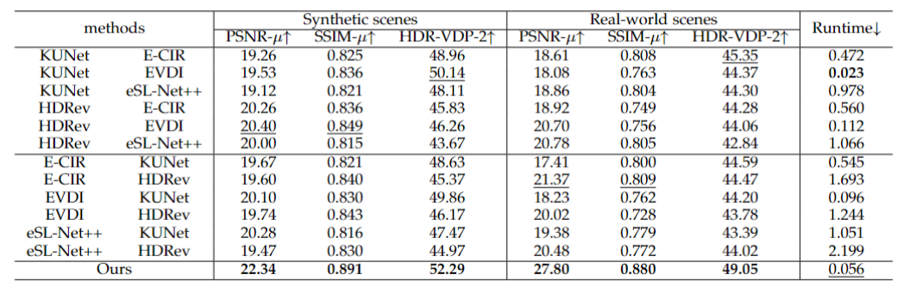
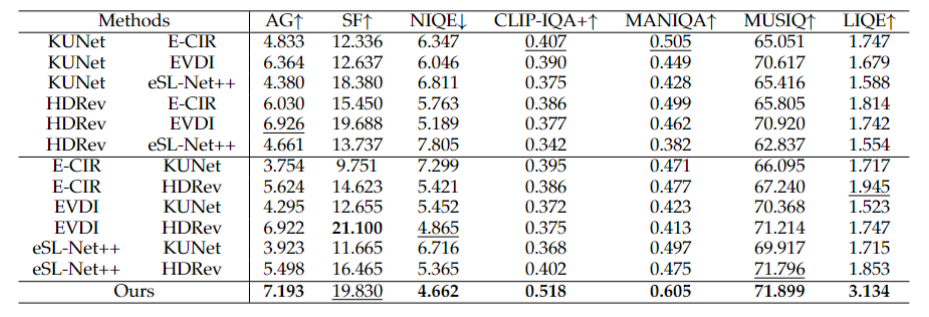

# HDR Imaging for Dynamic Scenes with Events
## [Paper](https://arxiv.org/abs/) | [Website](https://LXP-WHU.github.io/Self-EHDRI/)

High Dynamic Range Imaging (HDRI) for dynamic scenes often suffers from intensity saturation and motion blur because over/under exposures and fast-moving objects may occur simultaneously. Therefore, it is struggling to recover sharp latent HDR images from the blurry LDR input since the presence of motion blur inevitably aggravates the ill-posedness of HDRI. In this work, we propose an effective self-supervised Event-based HDRI framework to restore a sequence of Sharp HDR images from a single Blurry LDR input (E-BL2SH) where the burden of HDRI for dynamic scenes can be significantly relieved since events possess the property of extremely high temporal resolution and high dynamic range. Specifically, our Self-EHDRI framework is composed of two branches, \ie the main branch for restoration of the saturated regions with over/under exposures and the sharp clear latent intensities, and the assistance branch to enable the main branch to be trained without ground-truth sharp HDR images and generate colorful and visually pleasing results. To evaluate the effectiveness of our method, we construct large-scale synthetic and real-world datasets for Self-EHDRI, encompassing both static and dynamic HDR scenes with motion blurs, and each data sample is composed of the aligned blurry LDR image and corresponding events. Comprehensive experiments demonstrate that the proposed Self-EHDRI outperforms state-of-the-art approaches by a large margin.

<center>
<div style="color:orange; border-bottom: 1px solid #d9d9d9;
    display: inline-block;
    color: #000;
    padding: 2px;">
      Quantitative comparisons on static HDR scenes with motion blurs
  	</div>
    
    <br>
</center>
<center>
<div style="color:orange; border-bottom: 1px solid #d9d9d9;
    display: inline-block;
    color: #000;
    padding: 2px;">
      Quantitative comparisons on dynamic HDR scenes with motion blurs
  	</div>
    
    <br>
</center>

## Environment setup
- Python 3.8.13
- Pytorch 2.0.0
- NVIDIA GPU 4090 + CUDA 11.7
  
You can create a new [Anaconda](https://www.anaconda.com/products/individual) environment as follows.
<br>
Clone this repository.
```
git clone https://github.com/LXP-WHU/Self-EHDRI.git
```
Install the above dependencies.
```
cd Self-EHDRI
conda env create -f Self-EHDRI.yaml
```
Install the above dependencies.
```
cd Self-EHDRI
conda env create -f Self-EHDRI.yaml
```
## BL2SHD Dataset Benchmark
[The datasets]([https://drive.google.com/drive/folders/](https://drive.google.com/drive/folders/1cGjTEeurr6Ka4Tb5jTZDtB8IPlaBBuQG?usp=sharing)) can be downloaded via Google Drive.
<br>
The BL2SHD Dataset contains three types of data:
- **BL2SHD-S** contains HDR-LDR image pairs from Kalantari13, HDM-HDR-2014, and DeepHDRVideo. These datasets contain paired LDR-HDR video sequences which can be leveraged to synthesize events. Specifically, the blurry LDR image is obtained by averaging 13 consecutive LDR images, with corresponding HDR images serving as the sharp HDR sequence. We utilize the ESIM simulator \cite{rebecq2018esim} to synthesize concurrent events for each blurry LDR image.
- **BL2SHD-Rsimple** contains aligned real-world blurry LDR images, sharp HDR sequence, and real-world event streams images, which are captured by FLIR BFS-U3-32S4 camera, FLIR BFS-U3-04S2 camera, and SilkyEvCam event camera in static scenes.
- **BL2SHD-Rcomplex** contains aligned real-world blurry LDR images, sharp LDR images, and real-world event streams images, which are captured by FLIR BFS-U3-32S4 camera, FLIR BFS-U3-04S2 camera, and SilkyEvCam event camera in dynamic scenes.

## Quick start
### Initialization
- Change the parent directory
```
cd Self-EHDRI
conda activate Self-EHDRI
```
### Test
- Test on BL2SHD-S
```
bash test_syn.sh
```
- Test on BL2SHD-Rsimple
```
bash test_Rsimple.sh
```
- Test on BL2SHD-Rcomplex
```
bash test_Rcomplex.sh 
```
